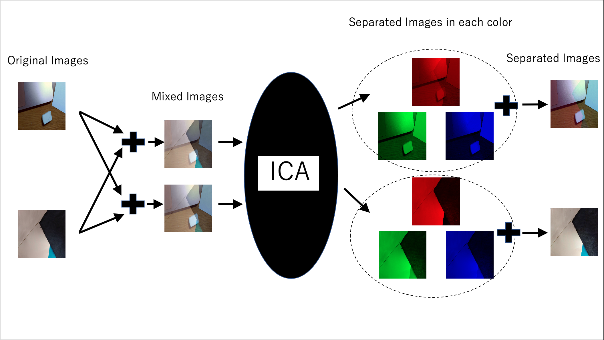

# ICAapp


## Overview

**This is an GUI Desktop application which execute Independent Component Analysis(ICA) for sound files(wav) or image files(png gray & color) which you selected.**

ICA is one of the statistical methods that separates mixed multiple sounds or images. For example, there two wav files which mixed two different speaker's talk at different rations, by using ICA's algorithm, we can separate them to each speaker's talk. It is look like cocktail-parity effect.

ICA is included in scipy, but I don't use it in this app.



## Installation

### MacOS

#### Desktop Application(Binaries)

Download from latest Releases or Tags. Maybe that's all!

#### Desktop Application(Binaries) by yourself

Download main branch's files and directories, and move to `App-mac` directory.
Do below command.

```
$ pyinstaller App.py --onefile --clean --noconsole --icon=ica.ico --name ICAapp
```

The binaries is made in ~dist/ICAapp, and open it. It need about 20 seconds to start up.

If app doesn't move, please remove `--onefile` option.

##### Requirements

Python 3.7.3 and below packages.

```
Package                   Version
------------------------- -------
altgraph                  0.17.2
importlib-metadata        4.11.3
macholib                  1.15.2
numpy                     1.21.5
Pillow                    9.0.1
pip                       21.3.1
pyinstaller               4.10
pyinstaller-hooks-contrib 2022.2
scipy                     1.7.3
setuptools                40.8.0
typing_extensions         4.1.1
zipp                      3.7.0
```

#### Desktop Application(By console)

Download main branch's files and directories, and move to `App-mac` directory.
Do below command.

```
$ python3 App.py
```

You need python's environment on you PC in this method.

### Windows

#### Desktop Application(Binaries)

Download from latest Releases or Tags. Maybe that's all!

#### Desktop Application(Binaries) by yourself

Download main branch's files and directories, and move to `App-win` directory.
Do below command.

```
> pyinstaller App.py --onefile --clean --noconsole --icon=ica.ico --name ICAapp
```

The binaries is made in ~dist/ICAapp, and open it. It need about 20 seconds to start up.

If app doesn't move, please remove `--onefile` option.

##### Requirements

Python 3.10.2 and below packages.

```
Package                   Version
------------------------- --------
altgraph                  0.17.2
future                    0.18.2
numpy                     1.22.3
pefile                    2021.9.3
Pillow                    9.0.1
pip                       22.0.4
pyinstaller               4.10
pyinstaller-hooks-contrib 2022.2
pywin32-ctypes            0.2.0
scipy                     1.8.0
setuptools                58.1.0
```

#### Desktop Application(By console)

Download main branch's files and directories, and move to `App-win` directory.
Do below command.

```
> python3 App.py
```

You need python's environment on you PC in this method.

### Linux

Sorry, I did operation confirmation only on MacOS & Windows I want to do it on Win and Linux for the future.

## Usage


- Select files
- Push appropriate button which run ICA

You can delete selected file by clicking the number button on the left side.

**Sometimes, separation may fail(only one sound or image is saved), please try several times**

This may be caused by the selecting initial variables.

### `Run (wav)` Button

- More than two wav files
- Only wav files selected
- same size & sampling rete wav file

### `Run (png gray)` Button

- More than two png files
- Only png files selected
- same size png file

### `Run (png color)` Button

- More than two png (**color**) files
- Only png (**color**) files selected
- same size png (**color**) file

### `Synthesize png(r,g,b)` Button

In color png ICA, it is difficult to get perfect separated images, so select images which succeeded separation in each color(r, g, b), and synthesize these 3 images.

- More than three png (**color**) files
- Only png (**color**) files selected
- same size png (**color**) file

## License

```
MIT License

Copyright (c) 2022 aiutarsi

Permission is hereby granted, free of charge, to any person obtaining a copy
of this software and associated documentation files (the "Software"), to deal
in the Software without restriction, including without limitation the rights
to use, copy, modify, merge, publish, distribute, sublicense, and/or sell
copies of the Software, and to permit persons to whom the Software is
furnished to do so, subject to the following conditions:

The above copyright notice and this permission notice shall be included in all
copies or substantial portions of the Software.

THE SOFTWARE IS PROVIDED "AS IS", WITHOUT WARRANTY OF ANY KIND, EXPRESS OR
IMPLIED, INCLUDING BUT NOT LIMITED TO THE WARRANTIES OF MERCHANTABILITY,
FITNESS FOR A PARTICULAR PURPOSE AND NONINFRINGEMENT. IN NO EVENT SHALL THE
AUTHORS OR COPYRIGHT HOLDERS BE LIABLE FOR ANY CLAIM, DAMAGES OR OTHER
LIABILITY, WHETHER IN AN ACTION OF CONTRACT, TORT OR OTHERWISE, ARISING FROM,
OUT OF OR IN CONNECTION WITH THE SOFTWARE OR THE USE OR OTHER DEALINGS IN THE
SOFTWARE.
```

## Bugs etc...

Please contact me through Issues or Pull requests. But I don't guarantee to see and reply it.
